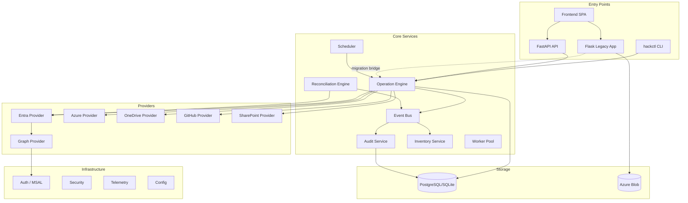
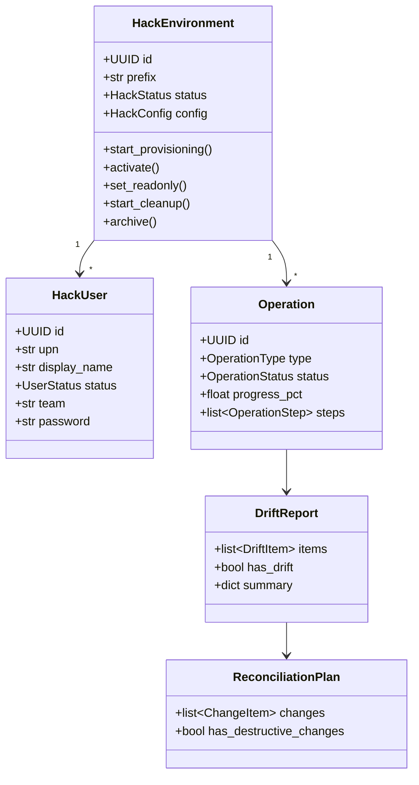
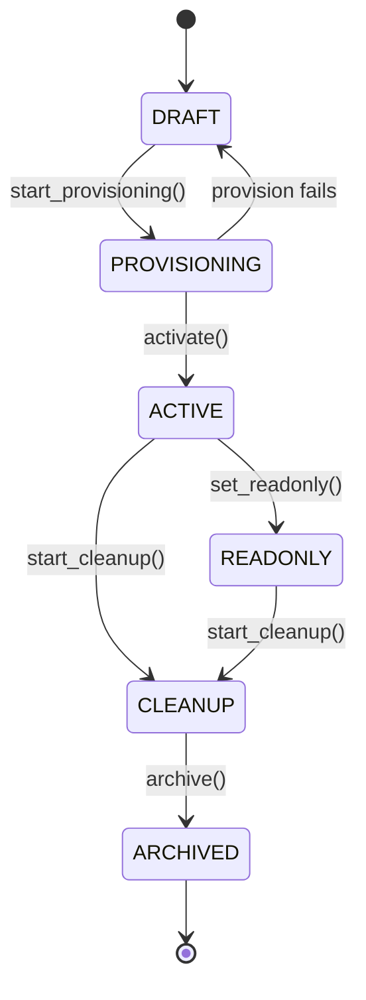
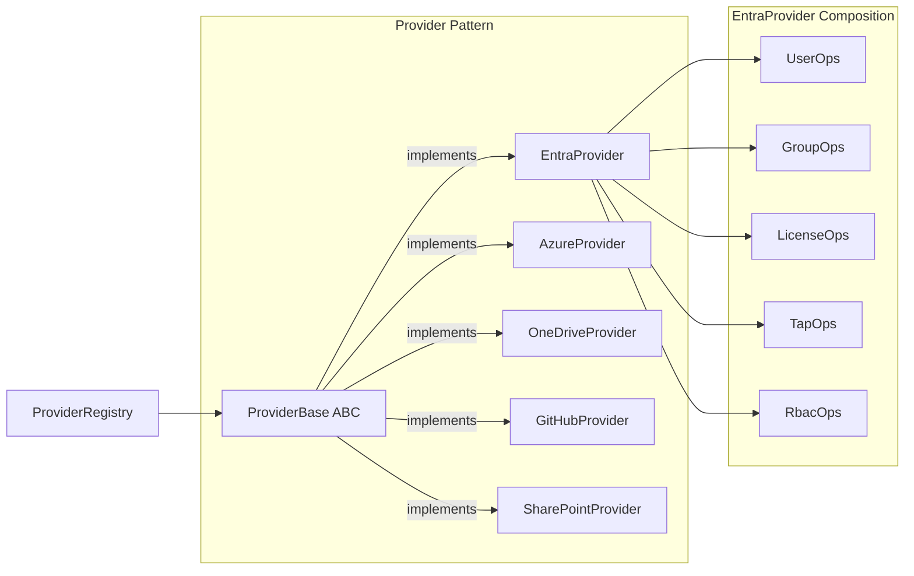

# Hackathon & Lab Orchestration Platform — Architecture

## Overview

Enterprise-grade platform for provisioning and managing hackathon/lab environments
across Microsoft Entra ID, Azure, GitHub EMU, OneDrive, SharePoint, and Power Platform.

## Architecture Diagram



## Domain Model



## Hack Lifecycle State Machine



## Provider Architecture



## Migration Roadmap

### Phase 1: Foundation (Current)
- [x] Domain models with Pydantic v2
- [x] Event bus with glob-pattern subscriptions
- [x] Provider abstraction layer
- [x] Reconciliation engine (Terraform-style)
- [x] Operation engine with step tracking
- [x] Audit service (passive + active)
- [x] Inventory service
- [x] Storage/repository layer (SQLModel)
- [x] Auth module (MSAL wrapper)
- [x] Security module (redaction, safeguards)
- [x] Scheduler service
- [x] Telemetry (structured logging, metrics)
- [x] Worker infrastructure
- [x] FastAPI API layer
- [x] hackctl CLI
- [x] Migration bridge adapters
- [x] CI/CD & Docker

### Phase 2: Integration
- [ ] Wire API routes to repositories and providers
- [ ] Connect hackctl CLI to live providers
- [ ] Run new platform alongside Flask app
- [ ] Validate parity via bridge adapters
- [ ] Database migration scripts (SQLite → PostgreSQL)
- [ ] OpenTelemetry integration

### Phase 3: Cutover
- [ ] Route all new requests through FastAPI
- [ ] Deprecate Flask routes
- [ ] Remove migration bridge
- [ ] Performance benchmarking
- [ ] Production deployment

## Directory Structure

```
src/platform_core/
├── __init__.py                 # Package version
├── core/
│   ├── __init__.py             # Type aliases
│   ├── errors.py               # Exception hierarchy
│   ├── interfaces.py           # Protocol contracts
│   └── config.py               # Layered configuration
├── models/
│   ├── hack.py                 # HackEnvironment aggregate root
│   ├── user.py                 # HackUser
│   ├── license.py              # License models + catalog
│   ├── group.py                # SecurityGroup
│   ├── resource.py             # ResourceType, TrackedResource
│   ├── github.py               # GitHubUser, GitHubRepository
│   ├── operation.py            # Operation with step tracking
│   ├── audit.py                # AuditEvent
│   ├── reconciliation.py       # DriftReport, ReconciliationPlan
│   ├── schedule.py             # ScheduleDefinition, CleanupPolicy
│   └── inventory.py            # InventoryItem, InventorySnapshot
├── events/
│   └── __init__.py             # EventBus + domain events
├── providers/
│   ├── base.py                 # ProviderBase ABC + ProviderRegistry
│   ├── graph/                  # GraphClient (async, retry, throttle)
│   ├── entra/                  # EntraProvider (users, groups, licenses, TAPs, RBAC)
│   ├── azure/                  # AzureProvider (RBAC)
│   ├── onedrive/               # OneDriveProvider (drives, uploads)
│   ├── github/                 # GitHubProvider (EMU)
│   └── sharepoint/             # SharePointProvider (stub)
├── reconciliation/
│   └── __init__.py             # ReconciliationEngine (detect → plan → apply)
├── operations/
│   └── __init__.py             # OperationEngine
├── audit/
│   └── __init__.py             # AuditService
├── inventory/
│   └── __init__.py             # InventoryService
├── storage/
│   ├── base.py                 # Repository ABCs
│   └── database/
│       ├── models.py           # SQLModel ORM models
│       └── repositories.py     # SQL repository implementations
├── auth/
│   └── __init__.py             # TokenProvider (MSAL)
├── security/
│   └── __init__.py             # Redaction, safeguards, validation
├── scheduler/
│   └── __init__.py             # SchedulerService
├── telemetry/
│   └── __init__.py             # Structured logging, metrics, correlation
├── workers/
│   └── __init__.py             # AsyncWorkerPool, TaskQueue
├── api/
│   ├── __init__.py             # FastAPI app factory
│   ├── deps.py                 # Dependency injection
│   └── routers/
│       ├── hacks.py            # Hack CRUD & lifecycle
│       ├── users.py            # User management
│       ├── reconciliation.py   # Drift detection & reconciliation
│       ├── operations.py       # Operation tracking
│       ├── audit.py            # Audit log
│       ├── inventory.py        # Resource inventory
│       └── scheduler.py        # Schedule management
├── cli/
│   └── __init__.py             # hackctl CLI (Click)
└── migration/
    └── __init__.py             # Bridge adapters (legacy → new)
```
